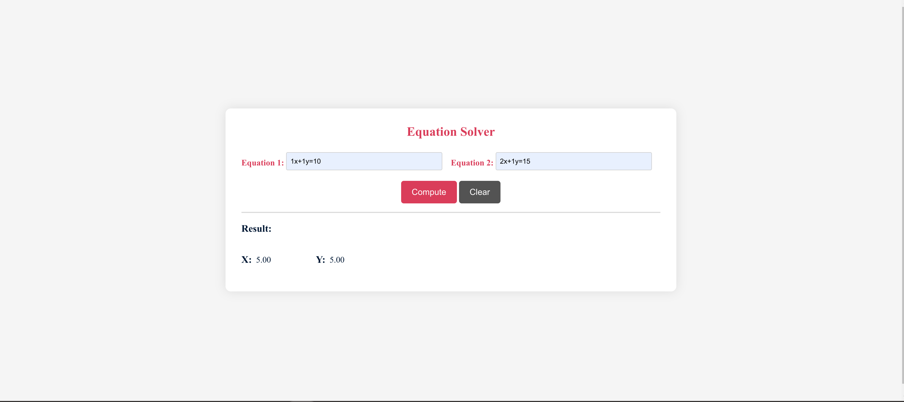

Sure, here's a sample README file for the Equation Solver web application:

# Equation Solver

Equation Solver is a simple web application that allows users to solve systems of linear equations using the method of substitution. The application takes two equations as input, each in the form of "ax + by = c", and calculates the values of variables 'x' and 'y' that satisfy both equations.



## Features

- Input two linear equations in the format "ax + by = c".
- Click the "Compute" button to calculate the solution for 'x' and 'y'.
- Click the "Clear" button to reset input fields and result display.
- Receive real-time validation and error messages for invalid inputs or unsolvable equations.

## Getting Started

To run the Equation Solver locally on your machine, follow these steps:

1. Clone the repository:

   ```
   git clone https://github.com/your-username/equation-solver.git
   ```

2. Open the `index.html` file in a web browser.

## Usage

1. Enter the coefficients of the equations in the input fields. For example:
   - Equation 1: `2x + 3y = 10`
   - Equation 2: `5x - y = 3`

2. Click the "Compute" button to calculate the values of 'x' and 'y' that satisfy both equations.

3. The calculated values will be displayed below the input fields. If the system of equations is not solvable or if the inputs are invalid, error messages will be shown instead.

4. Click the "Clear" button to reset the input fields and result display.

## Technologies Used

- HTML
- CSS
- JavaScript

## Known Issues

- The application currently supports only systems of linear equations in the format "ax + by = c".
- The solver assumes that there is a unique solution for the given equations.

## License

This project is licensed under the MIT License - see the [LICENSE](LICENSE) file for details.

## Acknowledgements

- The application design was inspired by various CSS frameworks and modern UI design trends.
- The equation solving logic is based on the method of substitution for systems of linear equations.

## Copyright

© 2023 Ahmed Makled. All rights reserved.
